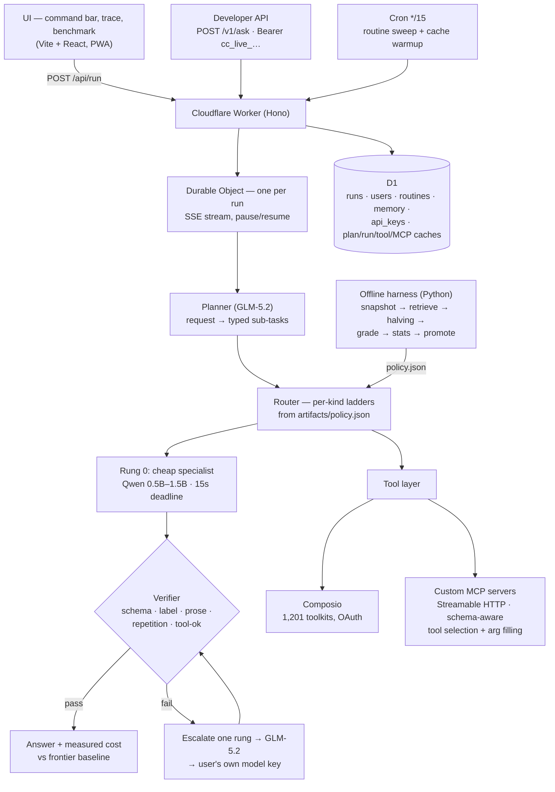

# CitizenCall

**Ask once.** One command bar for 1,200+ apps that routes every request to the
cheapest open-source model that can *prove* it did the job — verified answers,
honest cost accounting, background cron agents, and a public API.

**Live:** [citizencall.dev](https://citizencall.dev) ·
**Impact Forge Summer 2026** · Track: General Innovation ·
Demo script: [`docs/demo-script.md`](docs/demo-script.md) ·
Full design: [`SPEC.md`](SPEC.md)

Offline sweep receipts: [`artifacts/sweep-log.jsonl`](artifacts/sweep-log.jsonl)
(every routing-policy number is derived from it — see `harness/`).

## What it does

CitizenCall decomposes a request into typed sub-tasks (`classify`,
`extract_fields`, `summarize`, `normalize`), routes each to the cheapest
Featherless-hosted open model with a measured quality bar, **verifies every
hop**, and escalates exactly one rung on failure. The cost line under every
answer is measured against a frontier-only baseline — including the runs where
escalation makes savings *negative*.

Beyond chat: connected apps (Composio, 1,201 toolkits), user-supplied MCP
servers, chat-created cron routines with time-of-day scheduling, a
notifications feed of background runs, persistent memory, live voice input,
file attachments, and a keyed developer API (`POST /v1/ask`).

## Architecture



Key mechanisms, each visible in the live trace:

- **Verifier-gated escalation** — cheap rungs must pass structural checks
  (valid schema, one-line labels, prose-not-JSON for user-facing answers,
  degenerate-repetition detection, tool success). Failures escalate one rung;
  a stalled cheap rung is cut at 15s.
- **Four cache layers** — plan cache (global, cron-warmed), run-result cache,
  tool-call cache, and MCP tool-list/selection caches. Warm plans answer in
  under a second.
- **Schema-aware MCP execution** — for user-added MCP servers, a cheap model
  reads the server's real `tools/list` schemas to pick the tool *and* fill its
  arguments; keyword matching and deterministic fallbacks back it up.
- **Honest accounting** — every hop's tokens are priced and compared to the
  same request on the frontier model; the benchmark page aggregates it.

## Setup

Prereqs: Node 20+, `pnpm`, Python 3.11+ (harness only), a Cloudflare account.

```bash
git clone https://github.com/Kostia06/citizencall && cd citizencall

# 1. Worker (API + pipeline + cron)
cd worker && pnpm install
npx wrangler d1 create understudy            # paste the id into wrangler.jsonc
npx wrangler d1 execute understudy --file=schema.sql
npx wrangler dev                             # http://localhost:8787

# 2. UI (separate terminal)
cd ui && pnpm install && pnpm dev            # http://localhost:5173

# 3. Offline harness (optional — produces artifacts/policy.json)
cd harness && python -m venv .venv && source .venv/bin/activate
pip install -r requirements.txt
python snapshot.py && python retrieve.py
```

With **no secrets set**, everything runs in deterministic stub mode (models,
email, and voice are stubbed; 2FA codes appear in the login response) — the
full pipeline, tests, and UI work offline. For live mode:

```bash
cd worker
npx wrangler secret put FEATHERLESS_API_KEY   # model inference (required for live)
npx wrangler secret put AUTH_JWT_SECRET       # any long random string
npx wrangler secret put COMPOSIO_API_KEY      # app connections (optional)
npx wrangler secret put ELEVENLABS_API_KEY    # voice STT (optional)
npx wrangler secret put RESEND_API_KEY        # auth emails (optional)
```

Deploy: `cd ui && pnpm build`, then `cd worker && npx wrangler deploy`.

Tests: `cd worker && npx vitest run` (63 files) · `cd expo && npx jest`.

### Try the developer API

Create a key in Settings → Personal → API keys, then:

```bash
curl -s https://citizencall.dev/v1/ask \
  -H "Authorization: Bearer cc_live_..." \
  -H "Content-Type: application/json" \
  -d '{"text": "what can you do"}'
# long runs return 202 — poll GET /v1/runs/:id
```

## Repo layout

| dir | what |
|---|---|
| `worker/` | Hono on Cloudflare Workers, one Durable Object per run, D1 state, pipeline (`src/pipeline/`), auth, routines, public API |
| `ui/` | Vite + React + Tailwind — command bar, trace, benchmark, settings, memory, PWA |
| `harness/` | Python offline sweep: snapshot → retrieve → warmup → halving → grade → stats → promote |
| `artifacts/` | `policy.json` (live routing policy), `sweep-log.jsonl`, `results.json`, `funnel.json` |
| `docs/` | demo script, handoff notes |

## Limitations

- Live voice interim transcription prefers the Web Speech API (Chrome/Edge);
  other browsers fall back to chunked server-side STT.
- "Every work day" routines currently run daily (no day-of-week filter yet).
- Attached images/PDFs are display-only; text files (≤ 50 KB × 4) reach the
  model.
- `/v1/ask` runs that outlive the 50 s blocking window are not cost-billed to
  the key (request counts still are).

## Citations & services

- [Featherless.ai](https://featherless.ai) — serverless inference for all
  open-source models (Qwen 2.5, GLM-5.2)
- [Composio](https://composio.dev) — OAuth + tool execution for the 1,201-app
  catalog (logos served from their CDN)
- [Model Context Protocol](https://modelcontextprotocol.io) — Streamable HTTP
  transport for user-supplied tool servers
- [Cloudflare Workers / Durable Objects / D1](https://developers.cloudflare.com) —
  runtime, per-run actors, storage
- [ElevenLabs Scribe](https://elevenlabs.io) — speech-to-text ·
  [Resend](https://resend.com) — auth email
- UI: React, Vite, Tailwind CSS, framer-motion · Tests: Vitest
  (`@cloudflare/vitest-pool-workers`), Jest
