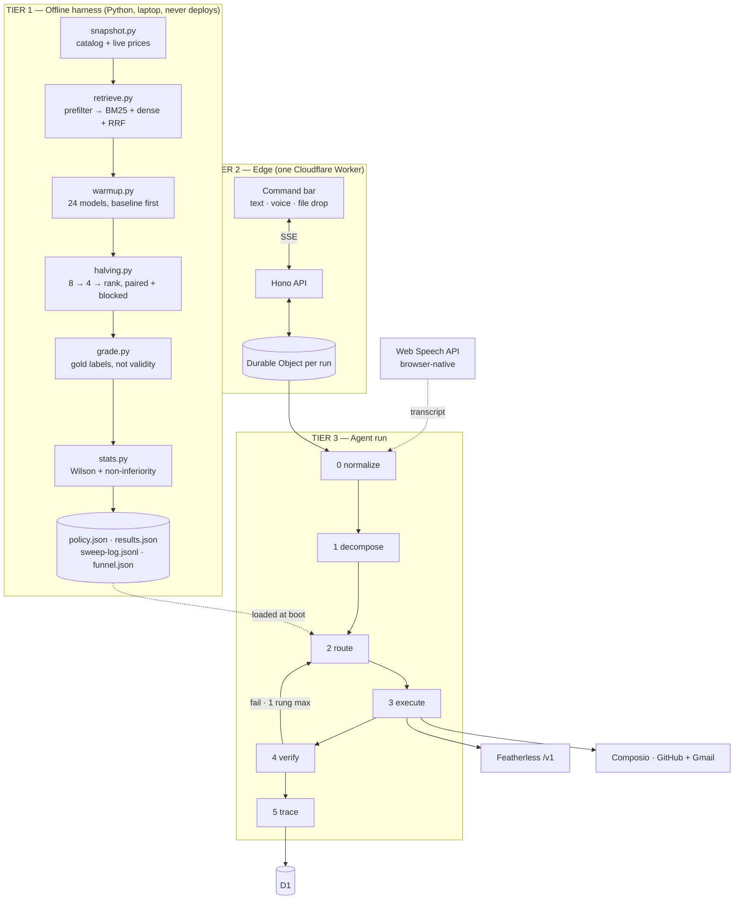

# Understudy — Complete Spec **v4**

> Retrieved from 34,504 tool-use-capable open models. N measured empirically.
> Your agent finds cheaper specialists by measuring on your own traffic.

**Impact Forge Summer 2026** · 2 people · Track: General Innovation (dual-eligible: Computational Research)

Standalone and complete. Supersedes v1–v3. Incorporates four adversarial reviews (feasibility, methodology, judging, fact-check) and adds speech-to-text.

---

## 1. Decisions

| | choice | note |
|---|---|---|
| Frontend | Vite + React + TS + Tailwind, static assets on one Worker | Not Next.js-on-Cloudflare; OpenNext at 2am kills weekends |
| Runtime | Hono on Cloudflare Workers + one Durable Object per run | DO holds run state + SSE |
| Languages | TS for worker/UI · Python for the offline harness | Harness never deploys → numpy/scipy free |
| State + cache | **D1 only** | KV is 1,000 writes/day free *and* eventually consistent — your cache demo would nondeterministically miss |
| Tools | Composio SDK in-Worker (verified on workerd, no `nodejs_compat`) | REST fallback in Appendix A |
| **S2T** | **Web Speech API in browser** | Featherless has no audio models. See §7. |

**Buy these now — 10 minutes, ~$30. Highest-leverage action in this document.**

- **Cloudflare Workers Paid, $5.** Free plan = **50 subrequests/request, and D1 queries count**. A realistic run hits 29–37. Three 503 retries and you get `Too many subrequests` mid-take. Free CPU is also 10ms/invocation and you do sha256 + zod + JSON parsing in there. Paid: 10,000 subrequests, 30s CPU, D1 1,000 queries/invocation.
- **Featherless per-request, ~$25.** Their Chat plan says verbatim: *"Not for reselling, app/API traffic, background automation, or benchmarking. Misuse may lead to cancellation without refund."* Featherless is a judging sponsor. Also 4 → 100 concurrency units: sweep goes **2.8 hours → 7 minutes**.

**Ownership.** A: harness, router, Featherless. B: Composio, worker API, UI. Both: `types.ts` and fixtures, together, first.

---

## 2. Architecture



Tier 1 has no deploy path. If Cloudflare fights you Saturday night, your evidence is already in git.

---

## 3. Repo

```
understudy/
├── README.md                       # judged artifact — §14
├── artifacts/
│   ├── catalog.json · candidates.json · funnel.json
│   ├── policy.json · results.json
│   ├── sweep-log.jsonl             # ← EVERY call. linked from README line 1
│   └── *.example.json              # committed FRIDAY — decouples A from B
├── harness/                        # PYTHON
│   ├── snapshot.py retrieve.py warmup.py scheduler.py
│   ├── halving.py evaluate.py grade.py stats.py promote.py
│   ├── derive_tasks.py             # traces → instances (or drop the claim)
│   └── tasks/{classify,extract_fields,summarize,normalize}.jsonl
├── worker/
│   ├── src/
│   │   ├── index.ts run.do.ts types.ts db.ts
│   │   ├── pipeline/{normalize,decompose,route,execute,verify,trace}.ts
│   │   ├── cache/{exact,tool,plan,verdict}.ts
│   │   └── providers/{featherless,composio}.ts
│   ├── schema.sql · wrangler.jsonc
├── ui/src/
│   ├── routes/{Bar,Roster,Benchmark}.tsx
│   └── components/{CommandBar,Orbs,TracePipeline,HopCard,Mic,DropZone}.tsx
├── tests/                          # ~10 tests. cheapest points available.
└── desktop/main.js                 # optional, Sunday, ~60 lines
```

---

## 4. Contract (`types.ts`) — write this first, together

```ts
export type TaskKind = 'classify' | 'extract_fields' | 'summarize' | 'normalize';
// normalize is voice-only and OPTIONAL — see §7.4

export interface TaskInstance {
  id: string; kind: TaskKind;
  instruction: string; input: string;
  gold: unknown;                 // label | reference JSON | must-contain facts
  split: 'held_in' | 'held_out';
}

export interface SubTask {
  id: string; idx: number; kind: TaskKind;
  instruction: string; ctxNeeded: number; needsTools: boolean;
  toolCall?: { toolkit: string; tool: string; args: Record<string, unknown> };
  dependsOn: string[]; sensitive: boolean;
}

export interface ModelCandidate {
  id: string; modelClass: string;
  contextLength: number; paramsB: number;
  pricePerMTokIn: number; pricePerMTokOut: number;  // PULL LIVE — see §5.2
  concurrencyCost: number;                          // from API, never inferred
  availability: 'warm'|'loading'|'cold'|'offline'|'unknown';
  isHotLive: boolean; toolUse: boolean;
  availableOnPlan: boolean; hfDownloads?: number;
}

export interface RouteDecision {
  subTaskId: string; modelId: string; score: number;
  reasons: string[];             // rendered in the UI — write for humans
  ladderPosition: number;        // 0 primary, 1 escalation (max 1)
  candidatesConsidered: number;
}

export type Verdict = 'pass'|'fail_schema'|'fail_grounding'|'fail_empty'|'fail_tool'|'fail_cold';

export interface Hop {
  id: string; subTaskId: string; modelId: string; modelClass: string; paramsB: number;
  promptTokens: number; completionTokens: number;
  costUsd: number; latencyMs: number; availability: string;
  verdict: Verdict; escalatedFrom?: string;
  cacheHit: 'none'|'exact'|'plan'|'tool';
}

export type TraceEvent =
  | { t:'run_start'; runId:string; userId:string; text:string; source:'text'|'voice' }
  | { t:'transcript'; raw:string; final:boolean }          // ← S2T
  | { t:'normalized'; from:string; to:string; ms:number; modelId:string }
  | { t:'plan'; plan:Plan; cacheHit:boolean; ms:number }
  | { t:'route'; decision:RouteDecision }
  | { t:'hop_start'; hop:Pick<Hop,'id'|'subTaskId'|'modelId'|'paramsB'> }
  | { t:'hop_end'; hop:Hop }
  | { t:'tool_call'; toolkit:string; tool:string; cacheHit:boolean; ms:number }
  | { t:'escalate'; from:string; to:string; reason:Verdict }
  | { t:'run_end'; runId:string; totalCostUsd:number; totalMs:number;
                   baselineCostUsd:number; savingsPct:number }
  | { t:'error'; message:string };

export interface Policy {
  version: string; generatedAt: string;
  weights: { quality:number; cost:number };        // latency dropped — §9
  ladders: Record<TaskKind, string[]>;             // length ≤ 2
  quality: Record<string, Partial<Record<TaskKind, number>>>;       // keyed by MODEL_ID
  qualityCI: Record<string, Partial<Record<TaskKind,[number,number]>>>;  // Wilson
  baselines: { frontier: string; cheapDefault: string };
  margin: Record<TaskKind, number>;                // δ, set BY sample size
}
```

`quality` keys on **`model_id`**, not `modelClass` — the whole thesis is that a specific fine-tune differs from its family.

---

## 5. Pipeline

### 5.1 Stage 0 — normalize (voice only)
Raw speech is messy: *"uh so can you like tell me what changed in the repo this week"*. `Qwen/Qwen3-0.6B` cleans it to *"Summarize this week's repository changes."* ~180ms, ~$0.000012. Skipped entirely for typed input. See §7.4.

### 5.2 Route

```
eligible(m,t) ⟺ m.contextLength ≥ t.ctxNeeded
            ∧ m.availability ∈ {warm, loading}
            ∧ m.availableOnPlan ∧ (m.toolUse ∨ ¬t.needsTools)

score(m,t) = w_q · quality[m.id][t.kind] − w_c · normCost(m,t)
weights: w_q 1.00, w_c 0.35     (in policy.json, never in source)
```

> ⚠️ **Price is NOT monotonic in parameter count on Featherless.** Verified live: `Qwen3-1.7B` = **$0.32/$1.60** while `Qwen3-8B` = **$0.0835/$0.4275**. `Qwen3-14B` ($0.12/$0.24) is cheaper than `Qwen3-4B` ($0.40/$0.80). **Build every ladder from `snapshot.py` output, never from intuition.** A ladder where the escalation target is cheaper than the primary is an own goal a judge will spot.

**Context:** 35 models exceed 32,768 — not 3. Beyond GLM-5.2 (262k) and GLM-4.7-Flash (202,752) there's gpt-oss-20b/120b (131k), MiniMax-M3, Kimi-K2.x, Qwen3.5-397B-A17B, Step-3.5-Flash, Nemotron-3-Super (all 262k). The cliff is real (35 of 45,190) but the ledge is wider than v2 claimed.

**Emit `reasons[]` for humans** — they render in the UI:
```
"accuracy 0.91 on extract_fields (n=12 held-out, Wilson [0.62,0.98])"
"$0.0004 vs cheap-default $0.0021 — 5.2× cheaper"
"warm · no cold-start penalty"
```

### 5.3 Execute

`@composio/core@0.16.0` runs on workerd via package `imports` conditions — **verified deployed without `nodejs_compat`**, 231 KiB gzip against a 3 MB free limit. Composio hosts the OAuth callback; your Worker handles a plain `GET` with `status` + `connected_account_id`.

**Add a `state` parameter and verify it.** v3's callback had none — that's textbook CSRF-on-OAuth-callback and the DevSecOps judge finds it in under a minute.

```ts
POST https://api.featherless.ai/v1/chat/completions
Authorization: Bearer ${KEY}
{ model, messages, temperature: 0, seed: 42, max_tokens: <ALWAYS SET> }
```

| code | meaning | action |
|---|---|---|
| 400 | model **cold** | requeue, mark `fail_cold`, **never** a benchmark failure |
| 403 | plan exclusion **or** HF gating | check `available_on_current_plan`; gating is a 30s browser fix |
| 429 | units exhausted — **immediate, no queue** | semaphore backpressure, not backoff |
| 503 | GPU capacity, transient | retry ≤3× |
| — | no documented timeout | set client to 120s |

### 5.4 Verify vs Grade — keep these separate

**`verify(output) → Verdict`** — runtime, no labels. Schema validity, non-empty, tool succeeded. Drives escalation.

**`grade(kind, output, gold) → float`** — harness only, needs labels. **This is what v2 was missing entirely.**

| kind | gold | metric |
|---|---|---|
| classify | label string | exact match |
| extract_fields | reference JSON | per-field exact → mean (partial credit) |
| summarize | 3–5 atomic must-contain facts | fraction entailed **AND** `len(out)/len(src) ≤ 0.4` |
| normalize | reference clean instruction | token-F1 vs reference |

The compression guard is one line and it kills the copy-the-source exploit — without it, a verbatim copy of the source scores maximum.

**Report both `validity` and `accuracy` columns.** The gap between them is itself a finding.

**Escalation: exactly one rung.** Pre-generation routing beats deep cascades structurally.

---

## 6. The bar — built, see `understudy-bar.html`

Matches your reference: 60px pill, `rgba(28,28,30,.72)` + `blur(34px) saturate(180%)`, asymmetric border (top edge brighter), four 48px circles.

**Circles carry demo weight, not decoration:**

| # | icon | behaviour |
|---|---|---|
| 1 | GitHub | dim → white on connect; two offset expanding rings while a `github.*` call is live |
| 2 | Gmail | same |
| 3 | Policy ◆ | opens `/roster`; `v3` badge appears after promotion |
| 4 | User ◑ | toggles `demo_kos` / `demo_teammate`, spins 180° — makes the cache-scoping shot possible |

**Interactions:** ⌘K focus · ↑↓ navigate · ⏎ run · ⇧⏎ bypass cache · Tab accept ghost autocomplete · Esc clear · drop files anywhere (bar scales 1.022, dashed accent border, chips pop in).

**Animation inventory:** entrance from `scale(.955) blur(6px)` spring · rotating conic-gradient border via `@property --a` while running · hop cards enter `translateY(10px) scale(.965) blur(3px)` staggered · failure hop **shakes** then the escalation arrow slides beneath · cost counter cubic-ease count-up on rAF · orb hover `translateY(-3px) scale(1.06)`.

The trace expands **downward** from a pinned bar — so the opening shot is the bar alone, then it grows. Better reveal than a dashboard loading.

---

## 7. Speech-to-text **[NEW]**

### 7.1 Featherless cannot do this
Verified: `/v1/models?q=whisper` returns **7 results, all text LLMs** with "whisper" in the name (`Liliths-Whisper-L3.3-70b` is a roleplay finetune). No audio modality anywhere in the catalog. **Do not plan on Featherless for STT.**

### 7.2 Use the Web Speech API — 25 lines, zero dependencies

```ts
const SR = (window as any).SpeechRecognition || (window as any).webkitSpeechRecognition;
const rec = new SR();
rec.continuous = false;
rec.interimResults = true;        // ← the demo value: live partial transcription
rec.lang = 'en-US';

rec.onresult = (e: any) => {
  let interim = '', final = '';
  for (let i = e.resultIndex; i < e.results.length; i++) {
    const t = e.results[i][0].transcript;
    e.results[i].isFinal ? (final += t) : (interim += t);
  }
  emit({ t:'transcript', raw: final || interim, final: !!final });
  setInput(final || interim);      // words appear in the pill as you speak
};
rec.onerror = (e:any) => e.error === 'not-allowed'
  ? toast('Microphone blocked') : toast('Speech unavailable — type instead');
```

Free, no key, no bundle cost. Interim results streaming into the pill is genuinely good on camera — the text materializes word by word.

**Mic button:** 5th element inside the pill, right of the input. Idle = `#8E8E93` mic glyph. Recording = red dot with a breathing ring and a 5-bar waveform driven by `AnalyserNode.getByteFrequencyData` — ~20 lines of canvas, and it's the difference between "a button turned red" and "the machine is listening."

### 7.3 ⚠️ The Electron gotcha — this kills your opening shot

**`webkitSpeechRecognition` throws a `network` error inside Electron.** Electron builds don't ship Google's Speech API keys, so the recognition service is unreachable. Long-standing and unresolved ([electron/electron#7749](https://github.com/electron/electron/issues/7749), [electron-prebuilt#205](https://github.com/electron-userland/electron-prebuilt/issues/205), [chromium-dev thread](https://groups.google.com/a/chromium.org/g/chromium-dev/c/RBZXqc0Zvmc)).

Your v3 demo opened with ⌘-space over a desktop — the Electron shell — and voice. **Those two cannot coexist.** Pick one:

| option | cost | verdict |
|---|---|---|
| **Film voice in the browser, ⌘-space shot separately** | 0 | ✅ **Do this.** Two cuts, nobody notices. |
| MediaRecorder → external STT API from Electron | ~90 min + a key | ✗ Not worth it |
| Transformers.js Whisper in-browser (WASM/WebGPU) | ~40 MB model, 2h | ✗ Fun, wrong weekend |
| Drop Electron entirely | −1h | Acceptable; browser command palette demos fine |

**Also:** Web Speech is Chrome/Edge only. Record in Chrome. Note the limitation in the README — it's one honest sentence and it costs nothing.

### 7.4 The interesting part: normalization as a routed sub-task

Voice transcripts are messy. That mess is a **task kind**, and cleaning it is exactly the cheap-specialist case your thesis is about:

```
raw:  "uh so can you like tell me what changed in the repo this week and uh
       maybe write the PR thing"
  → Qwen/Qwen3-0.6B · 180ms · $0.000012
norm: "Summarize this week's repository changes and draft a PR description."
```

On camera the raw transcript sits in grey, the cleaned version replaces it with a crossfade, and the trace shows an 800M-parameter model did it for a hundredth of a cent. **That's the thesis in four seconds, before you've explained anything.**

**Cost:** ~24 gold-labeled messy→clean pairs. They're short — ~30 minutes, not the 90 the other kinds take.

**Build it only if Saturday is clean.** If not, voice still works — the transcript goes straight to `decompose` and you lose the shot but nothing else. Marked optional in §16.

---

## 8. Caches — D1 only

| tier | key | TTL | scope |
|---|---|---|---|
| L0 | `Map` in the Durable Object | — | one run |
| L1 exact | `sha256(modelId ∥ prompt ∥ temp ∥ maxTokens ∥ seed)` | 24h | global (deterministic) |
| L2 tool | `sha256(userId ∥ toolkit ∥ tool ∥ canonicalJson(args))` | per-tool | **per user, always** |
| L3 plan | **exact match on `normalized`** (lowercase, strip punct, collapse ws) | 7d | **global, plan only** |
| L4 verdict | `(modelId, taskKind)` → rolling failure rate | — | global |

**L3 is exact-match, not semantic.** v2 required `embed()` inside the Worker, and there is no embedding provider on this stack — Featherless is text-gen only and no Workers AI binding was ever specified. The demo shot is about *scoping*, not ANN. Cite the semantic version as future work.

L2 TTLs: `gmail.*` 120s · `github.list_commits` 600s · `github.get_pull_request` 300s

**Scoping rule — verbatim in the README:**
> Global tiers key on request *shape*. Per-user tiers key on `user_id` and never omit it. No tier keyed without `user_id` may store tool output, or model output derived from tool output.

**The harness runs `noCache: true`, unconditionally, asserted.** Otherwise SH rounds after the first re-read cached completions and every interval resamples correlated data.

---

## 9. The harness

### 9.1 Order of operations — this was backwards in v2

`snapshot` → `retrieve` → **`warmup`** → sweep. v2 warmed before it knew what to warm, and tried to warm 120 models when realistic yield is 10–20.

**Do `snapshot.py` + `retrieve.py` Friday night** — pure laptop work, zero dependencies on the Worker. Commit `candidates.json`. Start `warmup.py` Friday night, **baseline first** (largest, slowest — docs say up to an hour for large models; 5 minutes for small).

`availability.tier` refreshes only every ~5 minutes, so confirm `warm` with one cheap real request before trusting it.

### 9.2 Retrieval

```python
prefilter = [m for m in catalog if
             m.contextLength >= kind.p95_ctx
             and (m.toolUse or not kind.needs_tools)
             and m.availability in ('warm','loading')
             and m.availableOnPlan and m.paramsB <= 35]

dense   = topk(cosine(embed(kind.query), cards), 100)
lexical = topk(bm25(kind.query, cards), 100)
candidates = reciprocal_rank_fusion(dense, lexical, k=60)[:8]
```

Hybrid because the text is bad: only **67%** of HF models have cards, ~**30%** of derivative cards are auto-generated, and card length drops ~**5,000 chars** parent→child. Lexical catches `-coder-`, `-instruct-`; dense catches paraphrase; RRF merges with no tuning.

**Two controls, ~30 min total, disproportionate credibility:**
- **Negative control** — add one deliberately-incompetent model (a small *base*, non-instruct checkpoint). If it survives round 2, your graders are broken and you learn it before the camera. *"Our negative control was eliminated in round 1"* is a line nobody else will have.
- **Retrieval control** — draw 2 of the 8 candidates uniformly at random from the prefilter set. If the retrieved 6 don't beat the random 2, hybrid retrieval added nothing.

### 9.3 The sweep — 2 rounds, paired, blocked

```
round 1:  8 candidates × 12 held-in   (ALL see the SAME instances) → keep 4
round 2:  4 candidates × 12 held-in (fresh)                        → rank
final:    top-1 per kind × 12 HELD-OUT, never seen by the selector
                                      ≈ 144 evals/kind
```

**Blocking is the best statistical change available.** Eliminate on mean *paired* difference vs the round leader, not raw score. Instance difficulty is the dominant variance component; blocking removes it. SE(Δ) at n=12 drops **0.177 → 0.097** at ρ=0.7 — a free 3.3× in effective sample, for ten lines.

**Tie-break explicit:** `(accuracy desc, cost asc)`. v2 never defined one, and since it ordered candidates cheap→expensive a stable sort would have made round 1 *a price sort with extra steps*.

**Errored/cold candidates: dropped with a recorded reason**, counted in the funnel. Never silently eliminated — that biases against exactly the long-tail models that are the thesis.

**Don't claim Karnin's guarantee.** At `temperature:0` the arms are deterministic given the instance; the only randomness is instance sampling. README: *"We use Successive Halving as a budget-allocation heuristic, not for its stochastic-bandit rate guarantee, which does not transfer to deterministic arms."* (Karnin et al. 2013 call it **Sequential** Halving; "Successive" is Jamieson & Talwalkar 2016. Cite both.)

### 9.4 Statistics

**Wilson intervals for proportions, not bootstrap.** Measured at n=12: bootstrap percentile at 12/12 returns **[1.000, 1.000]** — zero width, 0% coverage, in exactly the case you most want to advertise. Wilson gives [0.757, 1.000]. Closed-form, no resampling. Bootstrap only for the paired Δ — and say that sentence, it signals you know why.

**Promotion rule:**
```
promote iff
    accuracy_heldout ≥ incumbent_accuracy − δ_kind        (point estimate)
AND cost_effective   ≤ 0.50 × incumbent_cost_effective
where cost_effective = c_primary + p_escalate × c_escalation
      δ_kind ≈ 0.15    ← set BY the sample size. Say so.
```

**No Benjamini–Hochberg.** v2's rule was unsatisfiable: exact McNemar at n=12 with BH at m=120 gives a threshold of 0.000833, and the only reachable p-value is 0.000488 — requiring **all 12 discordant pairs one way**, i.e. incumbent scores 0 and candidate scores 1. **One outcome out of 3¹².** Worse, it contradicted the near-parity clause: a candidate that is *exactly as good and 30× cheaper* has p≈1.0 and fails.

Cite it as considered-and-rejected: *"FDR control targets false discoveries under a no-difference null. Our decision is non-inferiority, where the null runs the other way — BH would reject exactly the equal-quality-cheaper candidates we're looking for."* **That paragraph scores better than implementing it would have.**

**`cost_effective` matters.** Gating on primary cost alone while escalating on failure means a claimed 50% saving is really 38% at published 12.4% parse-failure rates — and at a 55% escalation rate a candidate is *more expensive* than the incumbent while passing the gate.

**Say the data-splitting sentence:** *"Successive Halving selects on held-in; all reported inference is on held-out instances the selector never saw. This is data splitting — the standard remedy for post-selection inference."* Assert it mechanically in `promote.py`. **Report the held-in → held-out drop** — it's your winner's-curse estimate, it will be large, and reporting it is credibility.

**Drop latency from scoring (`w_l = 0`).** v2's `score()` read a field no artifact produced, and cheap→expensive sweep ordering perfectly confounds price with time-of-day load. *"Latency was not controllable on shared serving infrastructure, so we excluded it rather than measure it badly."*

### 9.5 Gold labels — 72–96 instances

3 kinds × 24 (+24 for `normalize` if built). Run the frontier baseline once per instance, then **hand-correct.**

> **Critical:** if gold is unedited GLM-5.2 output, the incumbent scores 1.000 *by construction* and no candidate can ever win — the benchmark degenerates into "agreement with GLM-5.2." Hand-correction breaks the circularity. *"We hand-corrected 72 silver labels, changing 19"* is a strong README line.

### 9.6 Concurrency scheduler

Featherless *reserves* units: <16B = 1, <34B = 2, 70B+ = 4. Over budget → **immediate 429, no queue.**

```python
sem = UnitSemaphore(total=PLAN_UNITS)
def call(model, **kw):
    with sem.reserve(model.concurrencyCost):   # from API, never inferred
        return featherless(model, timeout=120, **kw)
```

Order cheap → expensive. A bug found on call 900 of Kimi K3 costs ~$8; on DeepSeek-V4-Flash, $0.38.

**Budget (25 credits ≈ $25, unconfirmed but strongly implied):** short calls (2K/500) across 6 models ≈ $19 per 1,000. Kimi K3 output is **5×** input ($2.00/$10.00). `max_tokens` on every call is your biggest lever.

---

## 10. Baselines — four bars

| bar | isolates |
|---|---|
| `GLM-5.2` everything | the straw man everyone reports |
| `GLM-5.2` + same verify/escalate loop | **the verifier's contribution, separated from routing** |
| **`Qwen3-4B` everything** | **the honest comparison — the obvious cheap default** |
| Understudy router | the thing you built |

Bar 3 is load-bearing. Without it your number can't distinguish *"discovery over 34,504 models found something special"* from *"we stopped using a frontier model for trivial subtasks"* — and the second needs no discovery, no retrieval, no SH, no policy.

**Measure `baselineCostUsd` once, offline, for each demo request.** v2 *computed* it; a judge asks "did you actually run the baseline?" and the true answer was no.

All numbers **cache-cold**. Report the conservative price.

---

## 11. Funnel — not a round number

```
45,190  models catalogued
34,504  tool-use-capable
     N  passed metadata prefilter
    24  retrieved (8 × 3 kinds)
     M  reachable at sweep time     ← report honestly
    12  survived round 1
     3  promoted
```

Cover line: *"Retrieved from 34,504 tool-use-capable open models; N measured empirically."* Nothing was measured across 34,504.

**Report the download distribution of reachable vs unreachable candidates.** Featherless models are warm largely *because they're popular*, so the availability filter selects toward well-known models and the long tail is under-sampled. Two histograms, one chart: *"Our filter selects toward popular models; our long-tail result is a lower bound on what exists."*

---

## 12. Schema

```sql
CREATE TABLE runs(id TEXT PRIMARY KEY, user_id TEXT, request_text TEXT, source TEXT,
  transcript_raw TEXT, created_at INTEGER, status TEXT,
  total_cost_usd REAL, baseline_cost_usd REAL, total_ms INTEGER,
  cache_hits INTEGER DEFAULT 0, plan_cache_hit INTEGER DEFAULT 0);
CREATE TABLE sub_tasks(id TEXT PRIMARY KEY, run_id TEXT, idx INTEGER, kind TEXT,
  ctx_needed INTEGER, needs_tools INTEGER, sensitive INTEGER DEFAULT 0, payload_json TEXT);
CREATE TABLE hops(id TEXT PRIMARY KEY, run_id TEXT, sub_task_id TEXT,
  model_id TEXT, model_class TEXT, params_b REAL,
  prompt_tokens INTEGER, completion_tokens INTEGER, cost_usd REAL, latency_ms INTEGER,
  availability TEXT, verdict TEXT, escalated_from TEXT, cache_hit TEXT, created_at INTEGER);
CREATE TABLE tool_calls(id TEXT PRIMARY KEY, run_id TEXT, sub_task_id TEXT,
  toolkit TEXT, tool TEXT, args_hash TEXT, cache_hit INTEGER, latency_ms INTEGER, created_at INTEGER);
CREATE TABLE roster(task_kind TEXT, model_id TEXT, model_class TEXT, promoted_at INTEGER,
  accuracy REAL, ci_lo REAL, ci_hi REAL, cost_per_1k REAL,
  displaced_model_id TEXT, hf_downloads INTEGER, PRIMARY KEY(task_kind, model_id));
CREATE TABLE verifier_stats(model_id TEXT, task_kind TEXT, attempts INTEGER DEFAULT 0,
  failures INTEGER DEFAULT 0, updated_at INTEGER, PRIMARY KEY(model_id, task_kind));
CREATE TABLE cache_entries(cache_key TEXT PRIMARY KEY, tier TEXT, user_id TEXT,
  value_json TEXT, created_at INTEGER, expires_at INTEGER, hits INTEGER DEFAULT 0);
CREATE TABLE plan_cache(normalized TEXT PRIMARY KEY, plan_json TEXT,
  created_at INTEGER, hits INTEGER DEFAULT 0);
CREATE INDEX idx_hops_run ON hops(run_id);
CREATE INDEX idx_runs_user ON runs(user_id, created_at DESC);
CREATE INDEX idx_cache_exp ON cache_entries(expires_at);
```

Accumulate hops in the DO, flush once with `db.batch()`. D1 is single-threaded per database.

---

## 13. API + config

| method | path | returns |
|---|---|---|
| `POST` | `/api/run` | `{userId, text, source, noCache?}` → `{runId}` |
| `GET` | `/api/run/:id/stream` | **SSE** `TraceEvent` |
| `GET` | `/api/run/:id` | full run + hops + tool_calls |
| `GET` | `/api/roster` | promoted models, what they displaced, downloads |
| `GET` | `/api/benchmark` | `results.json` |
| `GET` | `/api/funnel` | `funnel.json` |
| `POST` | `/api/connect` | `{userId, toolkit}` → Composio link (with `state`) |
| `GET` | `/oauth/done` | **verify `state`**, read `status` + `connected_account_id` |

**`wrangler.jsonc` must include `run_worker_first: ["/api/*", "/oauth/*"]`** — with SPA fallback on, `GET /oauth/done` returns `index.html` and never reaches your Worker. It presents as "Composio isn't calling us back" and you'll debug Composio for an hour.

**SSE, three fixes:** (a) keep an append-only event array in the DO and replay on connect, or start the run *inside* the stream handler — otherwise `run_start` and `plan` fire before EventSource attaches and are lost, every time; (b) emit `id:` and handle `Last-Event-ID` so reconnects don't duplicate; (c) `:ping` heartbeat every 15s or a slow model call stalls the stream with zero bytes on the wire.

Secrets: `FEATHERLESS_API_KEY`, `COMPOSIO_API_KEY`, `DEMO_USERS=demo_kos,demo_teammate`

---

## 14. README (10 pts — a judged artifact)

1. **Line 1: the audit link.** *"3,847 API calls. $18.40 spent. Full log: `artifacts/sweep-log.jsonl`. Every number below comes from it."* This is the cheapest credibility in the project — right now the claim is unfalsifiable, therefore unbelievable.
2. Pitch **with a number at real scale** — *"a two-person startup at 50k agent calls/day pays $X/mo; most are classification and extraction. $X → $Y."* Not `$0.0004`; that unit defeats the argument.
3. Four-bar chart above the fold
4. §2 diagram
5. Routing: the scoring function verbatim
6. Discovery: prefilter → RRF → 2-round paired SH → non-inferiority promotion
7. Cache scoping rule verbatim
8. **Techniques used vs deliberately declined** — SH/Hyperband/UCB/Thompson, RouteLLM, FrugalGPT, UniRoute, SCOPE, GPTCache, prefix caching, constrained decoding, self-consistency, LLM-judge, Wilson/bootstrap/McNemar/Bradley-Terry, LoRAX/S-LoRA. Cheap section, scores well.
9. Methodology: 72 hand-corrected instances, gold labels, cold-cache, held-out split, **models under 5B served FP16** (Featherless serves FP8 *above* 5B — the v2 caveat was inverted)
10. **Limitations with real numbers** — unreachable count, availability skews popular, n=12 → δ=0.15, Web Speech is Chrome-only, net-of-prompt-caching unmeasured
11. Citations (Appendix B)

---

## 15. Demo — open on the reveal

v2 buried its only surprising sentence at 1:10 and spent 90 of 170 seconds on static charts.

| time | shot |
|---|---|
| **0:00–0:20** | **Cold open on `/roster`.** *"This model has 340 downloads. Nobody uses it. On extraction it matches GLM-5.2 at one fifty-fifth the price — and we didn't pick it. We measured it, against labels we wrote ourselves."* |
| 0:20–0:40 | **Voice.** Hit the mic, speak the messy sentence, words materialize in the pill. Grey raw transcript crossfades to the cleaned instruction — *"an 800-million-parameter model did that for a hundredth of a cent."* Orbs 1–2 pulse as tool calls fire. |
| 0:40–1:05 | The run. Trace grows downward. **Escalation narrated as the catch:** *"the small model breaks schema here — we catch it before you ever see it, and step up one rung."* |
| 1:05–1:35 | `/benchmark`. **Four bars.** *"Cold cache. And the bar that matters is this one — against the obvious cheap default, not a frontier model nobody would use this way."* |
| 1:35–1:50 | **Raw log scrolling.** *"3,847 calls, $18.40. Every number above is in this file."* |
| 1:50–2:20 | Funnel + the honest limitation. |
| 2:20–2:40 | User switch → `plan: GLOBAL HIT` beside `data: USER MISS`. |
| 2:40–2:50 | Stack, repo. |

**Cut:** cost curve, standalone diagram, prior-art concession → all to the README, where they still earn Documentation points and cost no runtime. **Devpost hackathons this size are often judged asynchronously from video + repo — if there's no live Q&A, every prepared answer is worth zero unless it's written down.**

**Record in Chrome** (Web Speech). If you want the ⌘-space Electron opener too, film it as a separate cut — voice does not work inside Electron (§7.3).

**Keepalive pinger during recording:** `max_tokens=1` every 90s against every demo-path model. Warm models go cold and `tier` is 5 minutes stale.

**Find a real schema failure.** Budget 45 min to find a prompt where a small model genuinely breaks JSON at `temperature:0`. Hardcoding it is the fake demo you promised not to ship.

---

## 16. Hour-by-hour

**Tonight** — buy both plans · `types.ts` + committed `*.example.json` fixtures + `npm run db:reset` (90 min, together — these three decouple A from B all weekend) · `wrangler.jsonc` with `run_worker_first` · Composio spike · GitHub OAuth with `state` · **`snapshot.py` + `retrieve.py` → `candidates.json`** · **`warmup.py` starts, baseline first**

**Sat AM** · A: 72 instances with gold labels (~4h — this *is* the project) + `grade.py`. B: Composio GitHub+Gmail, `execute.ts`, L1/L2, the bar + mic.
**Sat noon** · sweep (~7 min at 100 units), then the four baselines.
**Sat PM** · A: `stats.py`, `promote.py`, `sweep-log.jsonl` export, controls. B: trace UI, `/roster`, `/benchmark` against fixtures.
**Sat eve** · both: `tests/`, seed demo data (burner Gmail, 5 emails; a repo with a week of commits), `normalize` kind **if clean**.
**Sun 9am** FREEZE — bugs and seed data only. Three rehearsals.
**Sun 1pm** HARD STOP ON CODE. Video + README.
**Sun 5pm** repo public, video incognito-viewable, every link clicked.

---

## 17. Novelty — the corrected claim

> **"We close the loop from usage traces to open-catalog model discovery: task-specific eval sets derived from the agent's own logged sub-tasks, used to empirically rank long-tail open fine-tunes, with measured winners promoted automatically into a live routing policy."**

State the gap as **your own observation**, not a citation. The survey (2603.04445) that v2 leaned on **does not say what v2 claimed** — it never mentions HuggingFace or production traces. Instead:

> *"Published routers we surveyed operate over 3–16 hand-picked models; RouterEval benchmarks 8,500 offline. We found none that both search a large open catalog and derive their eval set from the user's own traffic."*

**Never say:** "first to search a large catalog" (HuggingGPT 2023, HuggingR4 — which evaluates **1,110** models, not 2.5M; don't over-concede) · "first to auto-evaluate" (Braintrust, promptfoo) · "34,000+ models" without the funnel · "gets cheaper the more you use it" alone — that's [OpenRouter's Aug 10 copy](https://openrouter.ai/blog/announcements/introducing-the-new-auto-router/); append *"…because it learns from **your** traffic."*

**If `derive_tasks.py` doesn't get built, delete the "derived from traces" clause** and claim only the promotion loop. v2 claimed it in the pitch and hand-wrote the instances in the plan.

**Five hard questions:** ① *How do you find undocumented gems?* — we can't from cards; empirical probing, amortized once per kind. ② *LLMRouterBench says 31.7% and OpenRouter lost 24.7% to best-single-model* — 85% isn't our number; we route by *labeled sub-task kind*, not predicted difficulty, sidestepping the correctness-prediction bottleneck. ③ *Prompt caching is 75–90% off* — sharpest objection, why Manifest deprecated theirs; our sub-tasks are short and stateless with little prefix to cache, but we haven't measured net. ④ *Why not distill?* — no training run, no data egress, minutes not hours; complementary. ⑤ *Malformed JSON mid-pipeline?* — 5.4–12.4% published parse-failure rates, which is why every hop is schema-verified.

---

## 18. Risks

| # | risk | mitigation |
|---|---|---|
| 1 | Featherless ToS forbids benchmarking on consumer plans | **Buy the per-request plan.** Don't wait on Discord. |
| 2 | 50-subrequest / 10ms-CPU free limits break the demo mid-take | **Buy Workers Paid ($5).** |
| 3 | Cold models (up to 1h) | `warmup.py` tonight, baseline first; exclude cold at shortlist; 400 = requeue |
| 4 | Gold labels never written | A owns them as *the* deliverable, Saturday AM |
| 5 | Voice dead in Electron | Film in Chrome; separate cut for ⌘-space (§7.3) |
| 6 | OAuth callback swallowed by SPA fallback | `run_worker_first` tonight |
| 7 | First SSE events lost every run | DO replay buffer or start the run in the stream handler |
| 8 | Ladder built on wrong prices | Generate ladders from `snapshot.py`; prices aren't monotonic in size |
| 9 | Credits exhausted | Cap `max_tokens`; cheap→expensive; watch 5× output on Kimi |
| 10 | Demo against a real inbox | Burner Gmail, 5 seeded emails |

## 19. Cut list, in order
1. Electron shell 2. `normalize` kind 3. sensitivity tagging 4. L4 verdict cache 5. cross-encoder rerank 6. retrieval control 7. voice entirely

**Never cut:** gold labels · the sweep · four bars · `sweep-log.jsonl` · the escalation shot · README · video.

## 20. Definition of done
- [ ] Both plans purchased
- [ ] Every instance has a **gold label**; `grade.py` separate from `verify.ts`
- [ ] `results.json` reports validity **and** accuracy, Wilson intervals
- [ ] Four bars incl. cheap-default and baseline+verify-loop
- [ ] **`sweep-log.jsonl` committed, linked from README line 1**
- [ ] Negative control eliminated in round 1 (reported either way)
- [ ] Held-out assertion passes in `promote.py`
- [ ] Funnel with real numbers incl. unreachable count + download distribution
- [ ] `tests/` exists and passes · OAuth `state` verified
- [ ] Voice works in Chrome; limitation noted
- [ ] Video opens on the roster reveal, ≤3:00, incognito-viewable
- [ ] No fabricated pricing discrepancy · no survey citation · FP8 caveat corrected to "under 5B served FP16"

## 21. If the sweep finds nothing
> *"Across 24 candidates in 3 task kinds, N were unreachable and none of the reachable long-tail fine-tunes beat the cheap-default baseline. What did work: routing by sub-task kind cut cost X% against a frontier baseline at equal accuracy within our stated margin. The long-tail hypothesis is unconfirmed at our sample size — here's what testing it properly would take."*

Still a chart, a number, a limitation. **Honesty reads as confidence only when it's adjacent to a result** — so make sure bar 4 beats bar 1 even if nothing beats bar 3.

---

### Appendix A — Composio REST fallback
Base `https://backend.composio.dev` · header **`x-api-key`** (not Bearer) · v3.1
`POST /api/v3.1/tool_router/session` `{user_id}` · `GET …/session/{id}/tools` · `POST /api/v3.1/connected_accounts/link` `{auth_config_id,user_id,callback_url}` · `GET /api/v3.1/connected_accounts/{id}` → `ACTIVE|INITIATED|FAILED|EXPIRED|…` · `POST /api/v3.1/tools/execute/{SLUG}` `{user_id,arguments}`

### Appendix B — Citations
**Premise** Hidden Gems [2601.22157](https://arxiv.org/html/2601.22157v1) · LoRA Land [2405.00732](https://arxiv.org/html/2405.00732v1) · small-model extraction [2606.22606](https://arxiv.org/html/2606.22606v1) *(arXiv preprint, not peer-reviewed)* · NVIDIA SLM agents [2506.02153](https://arxiv.org/abs/2506.02153)
**Routing** LLMRouterBench [2601.07206](https://arxiv.org/abs/2601.07206) · routing plateau [2606.07587](https://arxiv.org/html/2606.07587) · route-vs-cascade [2605.06350](https://arxiv.org/abs/2605.06350) · RouteLLM [2406.18665](https://arxiv.org/html/2406.18665v4) · FrugalGPT [2305.05176](https://arxiv.org/abs/2305.05176) · RouterEval [2503.10657](https://arxiv.org/abs/2503.10657) · UniRoute [2502.08773](https://arxiv.org/abs/2502.08773)
**Method** Karnin/Koren/Somekh 2013 (Sequential Halving) · Jamieson & Talwalkar 2016 (Successive Halving) · Hyperband, Li et al. [1603.06560](https://arxiv.org/abs/1603.06560)
**Limitations** parse failures [2605.07395](https://arxiv.org/html/2605.07395v1) · oracle-gap label noise [2607.03436](https://arxiv.org/html/2607.03436) · commit messages [2502.18904](https://arxiv.org/pdf/2502.18904) · model cards [2508.06811](https://arxiv.org/html/2508.06811v1) · [Manifest deprecation](https://manifest.build/blog/why-we-deprecated-our-llm-router/)
**Prior art** [OpenRouter Auto Router](https://openrouter.ai/blog/announcements/introducing-the-new-auto-router/) · HuggingR4 [2511.18715](https://www.arxiv.org/abs/2511.18715) · [HuggingGPT](https://github.com/microsoft/JARVIS) · [Braintrust](https://www.braintrust.dev/articles/best-llm-routers-2026) · [distil labs](https://www.distillabs.ai/blog/from-production-traces-to-a-faster-cheaper-accurate-model/)
**Platform** [Featherless models API](https://featherless.ai/docs/api-reference-models) · [concurrency](https://featherless.ai/docs/concurrency-limits) · [error codes](https://featherless.ai/docs/api-reference-error-codes) · [credits](https://featherless.ai/docs/request-pricing-and-credits) · [Workers limits](https://developers.cloudflare.com/workers/platform/limits/) · [D1 limits](https://developers.cloudflare.com/d1/platform/limits/) · [Composio changelog](https://docs.composio.dev/reference/changelog) · [Electron speech issue](https://github.com/electron/electron/issues/7749)
